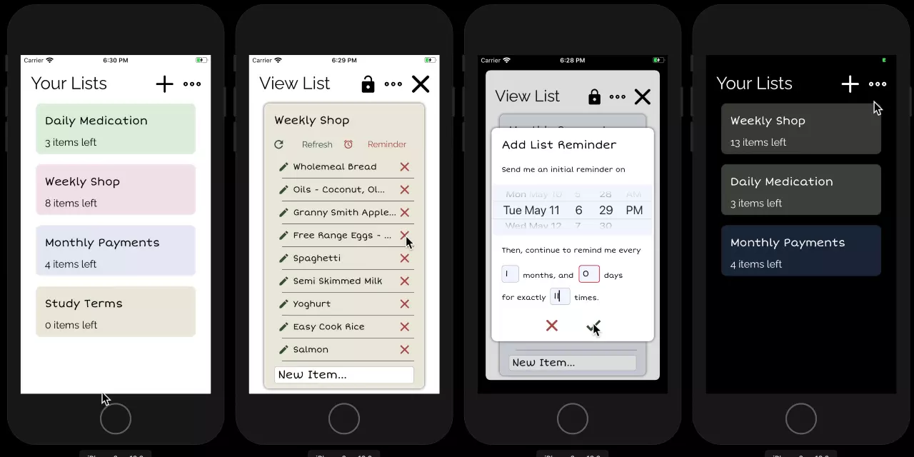

# Refresh Lists
iOS App to create and review re-usable checklists with reminders.

## Usage

[Video Demo](https://youtu.be/x8XtxqdA8oc)

## Requirements
- iOS 13.2 Device or Emulator
- Permission to access to iOS Reminders

## Features
- Create, Rename, & Delete Multiple Checklists
- Mark Items as Completed/Uncompleted
- Add, Edit, Remove and Re-order List Items
- Reset the state of the list with the "Refresh" button
- Create Multiple Recurring reminders to review list in iOS Reminders App that sync through iCloud
- All Data Stored Locally - Works Offline
- Customize Checklists with Colors
- Light & Dark Theme Available

## Building
1. Clone/Download the [Source Code](https://github.com/ganeshh123/refresh-lists)
2. Open `Refresh Lists.xcodeproj` in [Xcode 11](https://xcodereleases.com/) or higher
3. Build/Run in iOS 13.2 or higher device or emulator